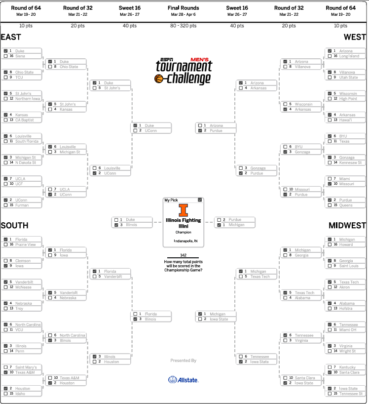
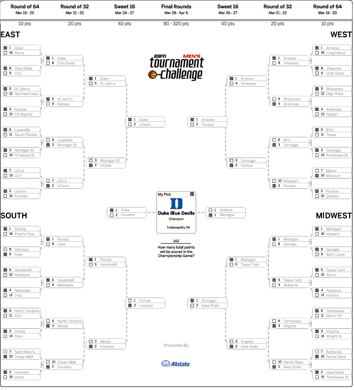

## March Madness Bracket Predictor
## Joshua Santy 2026

This repository contains code for a March Madness bracket predictor.
Currently, the model is trained on Bart Torvik's data.
Specific predictors are used to train 1) a Logistic Regression model and 2) a Lasso Logistic Regression model (currently)

There is a tournament simulation that maps out the result of the entire predicted tournament

# TODO (3/23/26):
- Investigate current variable selection
- Add more models (Ridge, Random Forest...)
- Add visualization of coefficients
- Optionally, start from scratch and use Kaggle data; better training/testing pipeline

